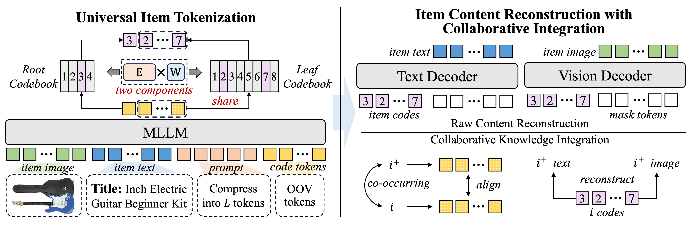

# UTGRec

This is the official PyTorch implementation for the paper:

> Universal Item Tokenization for Transferable Generative Recommendation

## Overview

In this paper, we propose **UTGRec**, a <u>U</u>niversal item <u>T</u>okenization approach for transferable <u>G</u>enerative  <u>Rec</u>ommendation. Specifically, we design a universal item tokenizer for encoding rich item semantics by adapting a multimodal large language model (MLLM).  By devising tree-structured codebooks, we discretize content representations into corresponding codes for item tokenization. To effectively learn the universal item tokenizer on multiple domains, we introduce two key techniques in our approach. For raw content reconstruction, we employ dual lightweight decoders to reconstruct item text and images from discrete representations to capture general knowledge embedded in the content. For collaborative knowledge integration, we assume that co-occurring items are similar and integrate collaborative signals through co-occurrence alignment and reconstruction. Finally,  we present a joint learning framework to pre-train and adapt the transferable generative recommender across multiple domains. Extensive experiments on four public datasets demonstrate the superiority of UTGRec compared to both traditional and generative recommendation baselines.



## Requirements

```
torch==2.4.1+cu124
transformers==4.45.2
deepspeed==0.15.4
accelerate==1.0.1
flash-attn==2.6.3
```

VAE checkpoint for DiffLoss:  [download.py](https://github.com/LTH14/mar/blob/main/util/download.py)

## Script

Pre-training: `pretrain.sh`

Finetuning: `finetune.sh`

